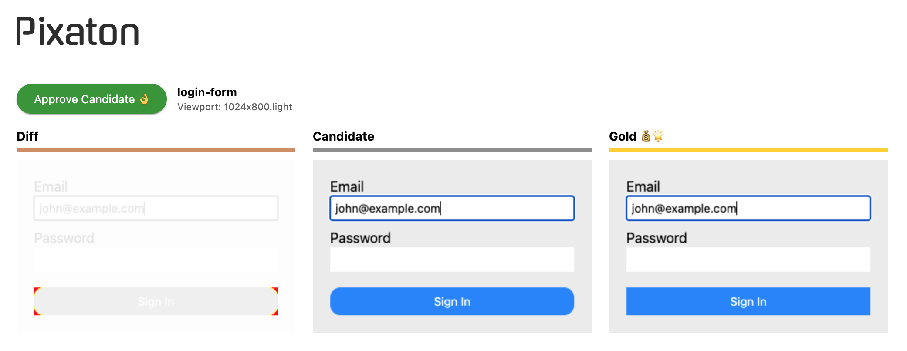

 
Pixaton is a collection of Puppeteer helpers for testing UIs by pixel diffing screenshots.

On an M1 MacBook Pro, 120 screenshots take 60 seconds.
Compare that to paid cloud-based products that need 12 minutes for that.

For speed, Pixaton reuses the headless browser instance, so some setup
is required, see [demo-tests/_setup.js](demo-tests/_setup.js). It
uses `--experimental-test-isolation=none`, so you’ll need Node v22.9+


## TL;DR

```sh
npm install puppeteer pixaton
```

`testPixels` forwards its configuration options to [Puppeteer](https://pptr.dev/)
and [pixelmatch](https://github.com/mapbox/pixelmatch), so it doesn’t limit versatility.
Take a look at [index.d.ts](index.d.ts) for details.

```js
// Create a wrapper in your main setup file:
import { myTestPixels } from './_setup.js'

myTestPixels(
  import.meta.filename, // For using the filename as the test name
  '/', // URL path
  'main', // CSS Selector
  {
    async setup(page) {
      await page.type('input[type=email]', 'john@example.com')
    }
  }
)
```

Here’s an example report, where the login button now has rounded corners.



Hitting **Approve Candidate** renames the corresponding
`.candidate.png` to `.gold.png`, and deletes `.diff.png`

The gold screenshots are meant to be saved in your
repository. So exclude the temporary PNGs.
### .gitignore
```shell
demo-tests/*.diff.png
demo-tests/*.candidate.png
```


## Getting Started Demo
- Checkout this repository
- `npm install`
- `npm install mockaton` (for running the demo app)
- `npm run demo`
- `npm run demo-test` (in another terminal tab)

The above report will open showing a diff of the login button with rounded corners.


## Examples
- `./demo-tests`
- Mockaton uses Pixaton, so you could explore [those examples](https://github.com/ericfortis/mockaton/tree/main/ui-tests) as well
